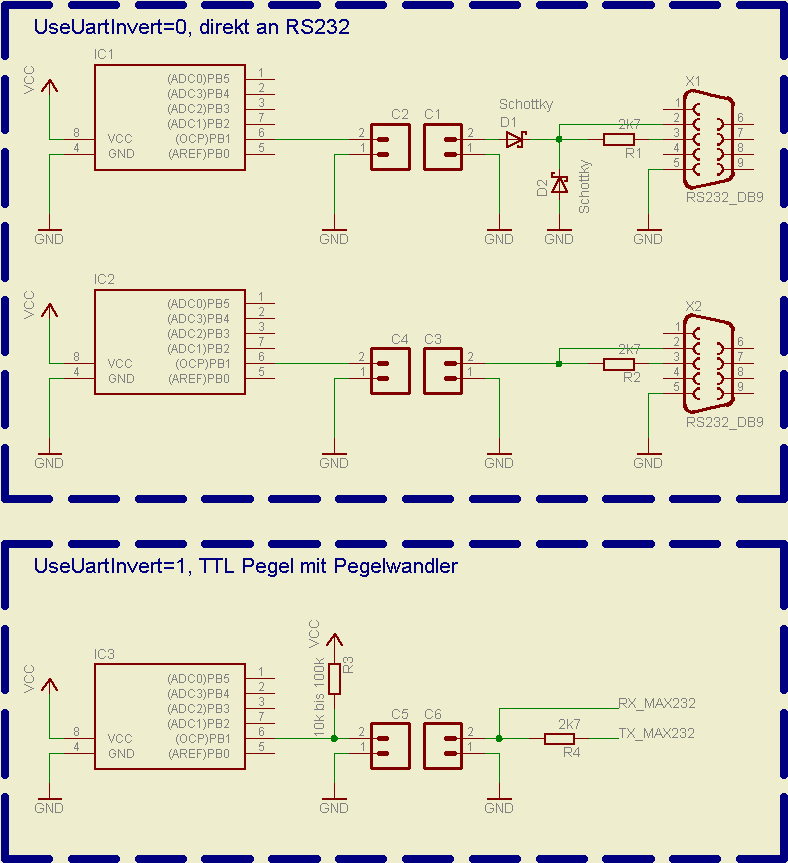

# [AVRootloader](../../tree/master) Test Projekt für [ATMega162](http://www.atmel.com/devices/ATMEGA162.aspx)

Demonstriert die nutzbare Funktionalität des [AVRootloader](../../tree/master) innerhalb einer Anwendungssoftware.

## ATMega162 Beschaltung
- interner RC Oszillator auf 8Mhz, `CKDIV8` Fuse aus
- an Pin `PD0` den RX Pin der RS232
- an Pin `PD1` den TX Pin der RS232, wenn man 2-Wire arbeitet ([AVRootloader.asm](./AVRootloader.asm) neu konfigurieren)
- an Pin `PD2` den RS485 Data Enable Pin wenn man diesen nutzen möchte ([AVRootloader.asm](./AVRootloader.asm) neu konfigurieren)
- Pin `PC0` wird mit `PD0` verschaltet damit man den Pin Change Interrupt benutzen kann

## Programm

- Das für 1-Wire direkt an RS232 konfigurierte [AVRootloader.asm](./AVRootloader.asm). 
- Mit AVRStudio per Doppelklick auf [AVRootloader.aps](./AVRootloader.aps) öffnen, neu komplieren und auf AVR programmieren. Danach Fuses auf Brownout bei 1.8Volt, interner RC Oszillator und `CKDIV8` Fuse deaktivieren.  
BOOTRST einschalten und `BOOTSZ` Fuses auf 512 Words.

## Lockbits 

- `LB` auf "Further programming and verification disabled"
- `BLB0` auf "No lock on SPM and LPM in Application Section"
- `BLB1` auf "LPM prohibited in Boot Section"

# Verdrahtung

- 1-Wire RS232 mit GND und `PD0` verbinden und [AVRootloader.exe](./AVRootloader.exe) starten.
 
- 1-Wire RS232:
  - RS232 Buchse ein 2k7 Widerstand vom Pin 2 nach 3 (RX zu TX)
  - Pin 5 ist Masse (Masse zu GND)
  - Pin 2 direkt an AVR Pin `PD0` (RX zu RX_AVR)

Diese Konfiguration funktioniert bei mir bis auf 1.8 Volt VCC runter.

## Links

[AVR-Bootloader mit Verschlüsselung von Hagen Re](https://www.mikrocontroller.net/articles/AVR-Bootloader_mit_Verschlüsselung_von_Hagen_Re)

[Forenthread auf µC.net](https://www.mikrocontroller.net/topic/95839#new)

&copy; Hagen Reddmann 2008..10